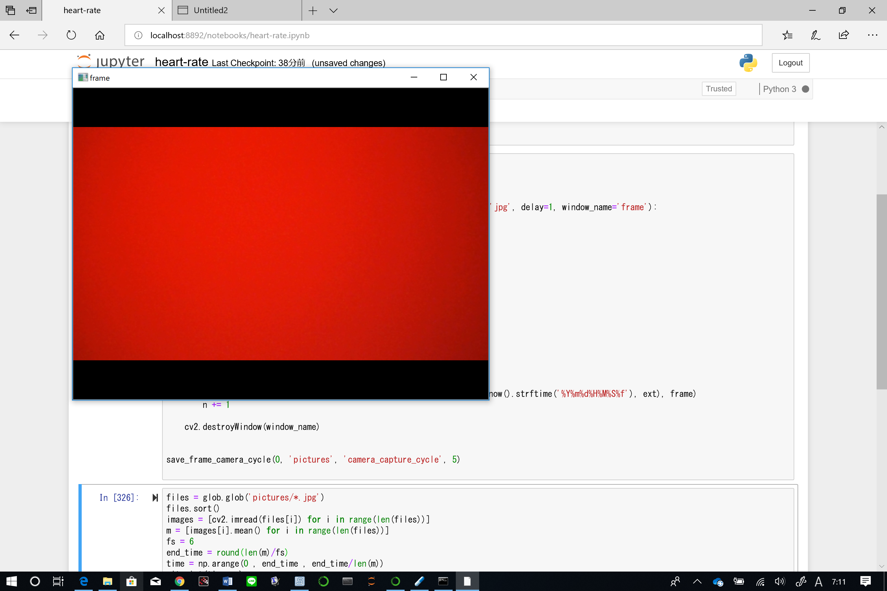
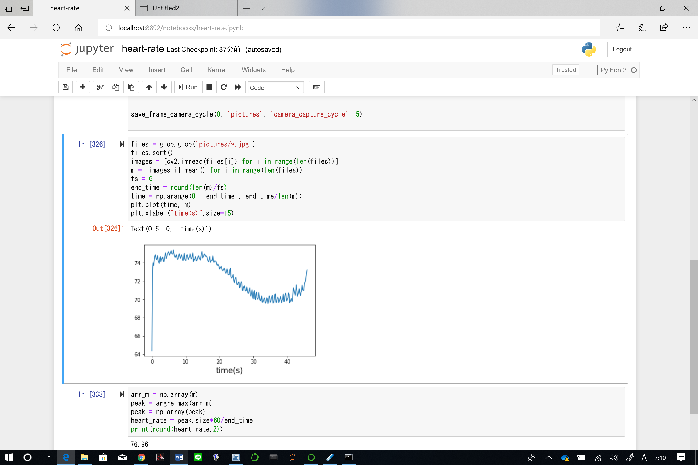
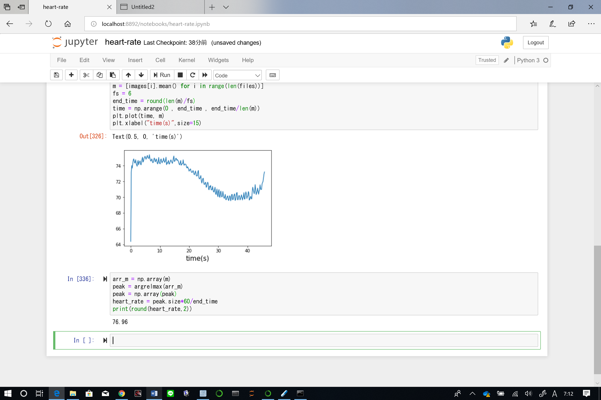

# heart-rate

## 処理の内容
- まず、OpenCVでカメラを呼び出し指定したディレクトリに保存する
- このとき5fps間隔で保存を行う
- ローカルに保存された画像を読み込んで、輝度値を数値化する
- 輝度値の平均を計算し、横軸時間でグラフにプロットし出力する
- 極大値（ピーク）の個数を数え、心拍数を計算し出力

## 使用方法
1. １つ目のセルを実行して必要なパッケージをインポートする
2. カメラの位置に指を置いた状態で次のセルを実行する
3. 脈拍を解析するのに十分な時間が経過したら'q'を押して画像のキャプチャを終了する
4. ３つ目のセルを実行すると、輝度値がグラフで出力される
5. 最後のセルを実行すると、心拍数が計算され出力される
  
## 参考にしたサイト
- OpenCVでカメラのリアルタイム動画から静止画を保存を行うために以下のサイトを参考にした  
https://note.nkmk.me/python-opencv-camera-to-still-image/  
このページの中ほどから書かれている**定期的に自動保存**のコードを引用した．このとき、正確な脈拍測定が行えるようサイクルを5とした．
- ローカルディレクトリに保存された画像の読み込み、計測までを以下のサイトを参考にした．  
https://qiita.com/ba-ton/items/8e428d2aa24288bac737  
このサイトの3，4，5，6を参考にコードを記述した．コピーしたコードではエラーが発生し、原因も特定できなかったため、簡単なコードに書き直した

## スクリーンショット

